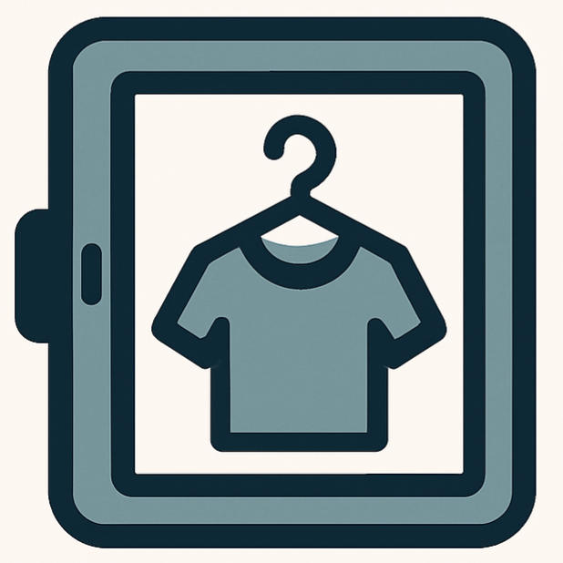

# NADA

---

## LOGO  

  

---

## Integrantes
- **Francisco Montero Sánchez** — 07256309Q  
  

- **Ana Montero Preciado** — 09213540Q  
  
---

## Eslogan    
*¿No tienes NADA que ponerte?* 

---

## Resumen

**NADA** es una aplicación web que permite gestionar un **armario digital personal**.  
Los usuarios pueden subir fotos de sus prendas, organizarlas por categorías y combinarlas para crear conjuntos personalizados de manera sencilla.

---

## Descripción  
NADA es una aplicación web diseñada para facilitar la gestión de tu armario digital personal.  
El sistema permite a cada usuario crear una cuenta y asociar un armario virtual donde puede subir fotos de sus prendas, organizarlas por categorías y características como color o talla, y combinarlas para crear conjuntos personalizados. 
El proceso es sencillo: sube una foto de tu prenda, elige la categoría (camiseta, pantalón, zapato, etc.), añade detalles como color y talla, y guarda la prenda en tu armario digital. Luego, selecciona varias prendas para crear un conjunto y guárdalo para futuras ocasiones.  
Ejemplo: Camiseta azul, Pantalón blanco, Zapatos negros — Conjunto “Reunión” (puedes añadir notas o comentarios hasta 256 caracteres).

---

## Funcionalidades, Requisitos, “Pliego de condiciones”  
- El usuario debe poder **crear una cuenta** y poder **acceder** a ella con un usuario y contraseña.
- El usuario debe poder **subir fotos de sus prendas** y almacenarlas en su armario virtual.
- El usuario debe poder **organizar las prendas** por:
    - Tipo de prenda (Parte superior, parte inferior o calzado)
    - Categorías (Dentro de la parte superior hay camisetas, sudaderas, chaquetas...)
    - Color
    - Marca
    - Talla
- El usuario puede **buscar prendas** introduciendo información en una barra de búsqueda.
    - La búsqueda puede ser por **tipo, categoría, color, marca o talla**.
    - Los resultados de la búsqueda se mostrarán **agrupados primero por tipo de prenda y luego por características**.
- La interacción con los resultados de la búsqueda contempla dos casos:
    - Si el usuario selecciona una prenda: puede **ver sus detalles y editar la información**.
    - Si el usuario selecciona varias prendas: puede **crear un conjunto personalizado**.
- La aplicación web debe ser **usable desde PC y móvil** (diseño responsive y adaptable al dispositivo).
- El usuario puede **añadir notas o comentarios** a cada conjunto creado (hasta **256 caracteres**).
- El usuario debe poder **eliminar o modificar** prendas y conjuntos de su armario digital.
- El usuario debe poder **ver los conjuntos guardados y las prendas disponibles** en su armario.
- La **persistencia de datos** debe garantizar que **cada usuario tenga su propio armario digital único**.

---

## Funcionalidades opcionales, recomendables o futuribles
- Recomendación automática de conjuntos según el clima o la ocasión.
- Posibilidad de compartir conjuntos en redes sociales.
- Estadísticas de uso (qué prendas usas más, colores favoritos, etc.).
- Sugerencias de compra relacionadas con las prendas del usuario.
- Modo colaborativo (compartir armarios entre amigos o familiares).
- Mostrar al usuario una **lista de conjuntos recomendados** generada aleatoriamente en base a las prendas más utilizadas o populares en su armario.
    - Al actualizar la página, la lista también se actualiza, repitiendo el proceso anterior.
- Posibilidad de **elegir el idioma** para la interfaz de usuario.
- En el proceso de creación de conjuntos, permitir la **inclusión de mensajes publicitarios**, enlaces a tiendas de moda, imágenes del conjunto o del usuario, y ofertas relacionadas con las prendas seleccionadas.

