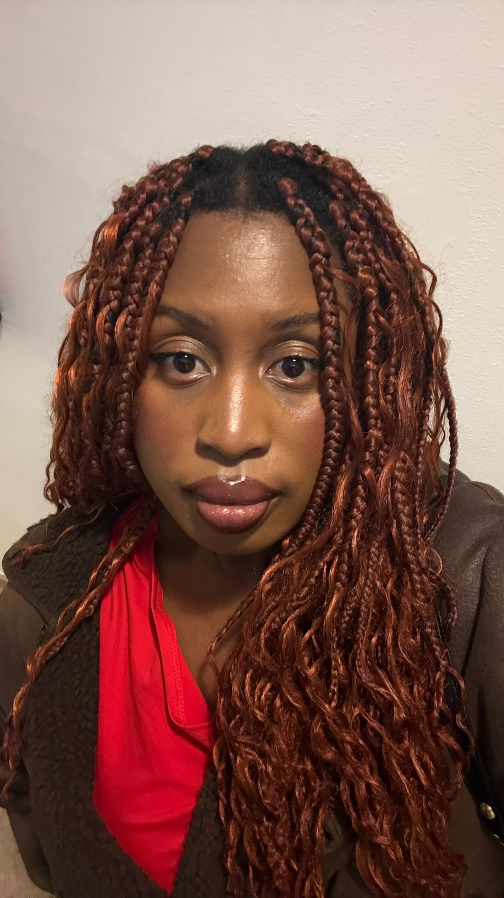
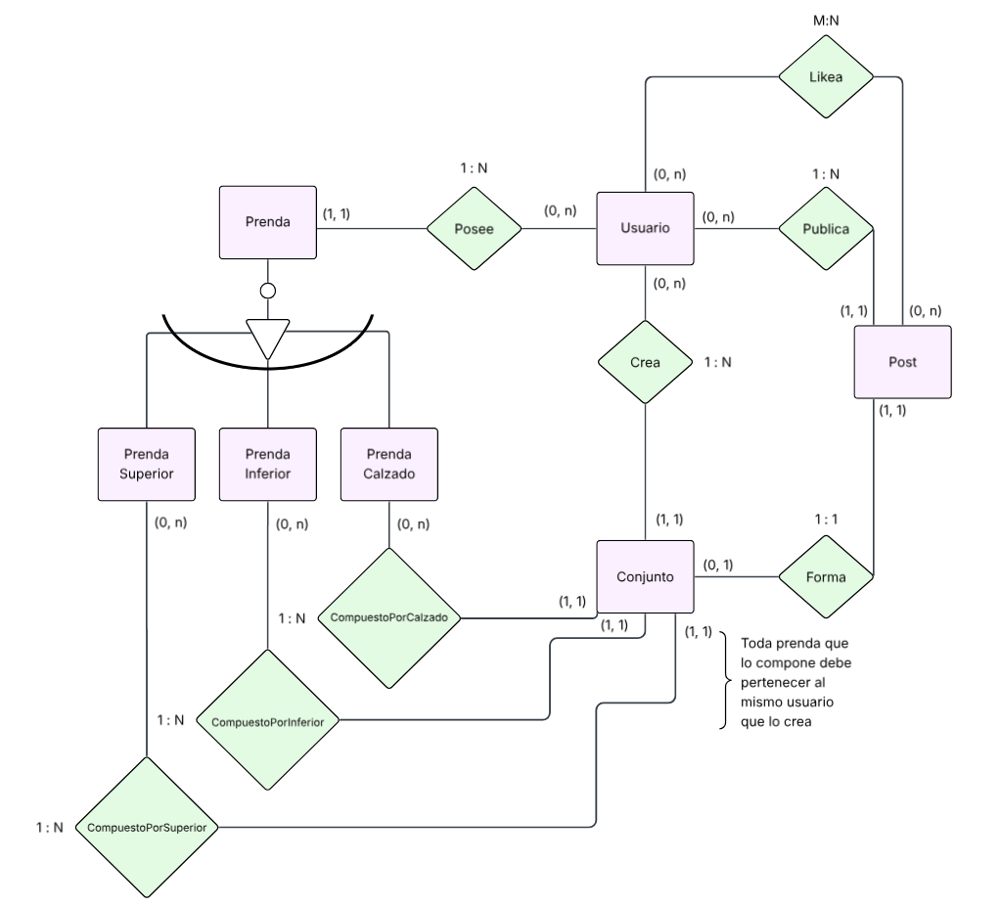

# NADA

---

## LOGO  
<p align="center">
  
</p>

---

## Integrantes
- **Francisco Montero Sánchez** — 07256309Q  
  

- **Ana Montero Preciado** — 09213540Q  
  
---

## Eslogan    
*¿No tienes NADA que ponerte?* 

---

## Resumen

**NADA** es una aplicación web que permite gestionar un **armario digital personal**.  
Los usuarios pueden subir fotos de sus prendas, organizarlas por categorías y combinarlas para crear conjuntos personalizados de manera sencilla.

---

## Descripción  
NADA es una aplicación web diseñada para facilitar la gestión de tu armario digital personal. <br>
El sistema permite a cada usuario crear una cuenta y asociar un armario virtual donde puede subir fotos de sus prendas, organizarlas por categorías y características como color o talla, y combinarlas para crear conjuntos personalizados.<br>
El proceso es sencillo: sube una foto de tu prenda, elige la categoría (camiseta, pantalón, zapato, etc.), añade detalles como color y talla, y guarda la prenda en tu armario digital. Luego, selecciona varias prendas para crear un conjunto y guárdalo para futuras ocasiones.<br><br>
Ejemplo: Camiseta azul, Pantalón blanco, Zapatos negros — Conjunto “Reunión” (puedes añadir notas o comentarios hasta 256 caracteres).

---

## Funcionalidades, Requisitos, “Pliego de condiciones”  
- El usuario debe poder **crear una cuenta** y poder **acceder** a ella con un usuario y contraseña.
- El usuario debe poder **subir fotos de sus prendas** y almacenarlas en su armario virtual.
- Cuando el usuario **suba una foto demasiado grande** debe poder recortarla en la propia aplicación.
- El usuario debe poder **organizar las prendas** por:
    - Tipo de prenda (Parte superior, parte inferior o calzado)
    - Categorías (Dentro de la parte superior hay camisetas, sudaderas, chaquetas...)
    - Color
    - Marca
    - Talla
- El usuario puede **buscar prendas** introduciendo información en una barra de búsqueda.
    - La búsqueda puede ser por **tipo, categoría, color, marca o talla**.
    - Los resultados de la búsqueda se mostrarán **agrupados primero por tipo de prenda y luego por características**.
- Una vez el usuario ha añadido prendas a su armario digital, pueden darse dos casos:
    - Si el usuario selecciona una prenda: puede **ver sus detalles y editar la información**.
    - El usuario puede **crear un conjunto personalizado** a partir de 3 prendas.
- La aplicación web debe ser **usable desde PC y móvil** (diseño responsive y adaptable al dispositivo).
- El usuario puede **añadir notas o comentarios** a cada conjunto creado (hasta **256 caracteres**).
- El usuario debe poder **eliminar o modificar** prendas y conjuntos de su armario digital.
- El usuario debe poder **ver los conjuntos guardados y las prendas disponibles** en su armario.
- La **persistencia de datos** debe garantizar que **cada usuario tenga su propio armario digital único**.
- Al **eliminar una prenda** se eliminarán los conjuntos que la referencien.
- Al **eliminar un usuario** se eliminarán todas sus prendas y conjuntos asociados.

---

## Funcionalidades opcionales, recomendables o futuribles
- Recomendación automática de conjuntos mediante Inteligencia Artificial (hecho).
- Posibilidad de publicar conjuntos y recibir likes (hecho).
- Estadísticas de uso (qué prendas usas más, colores favoritos, etc.).
- Sugerencias de compra relacionadas con las prendas del usuario.
- Modo colaborativo (compartir armarios entre amigos o familiares).
- Mostrar al usuario una **lista de conjuntos recomendados** generada aleatoriamente en base a las prendas más utilizadas o populares en su armario.
    - Al actualizar la página, la lista también se actualiza, repitiendo el proceso anterior.
- Posibilidad de **elegir el idioma** para la interfaz de usuario.
- En el proceso de creación de conjuntos, permitir la **inclusión de mensajes publicitarios**, enlaces a tiendas de moda, imágenes del conjunto o del usuario, y ofertas relacionadas con las prendas seleccionadas.

---

## Diagrama E-R


---

## Ejecución

Para ejecutar la aplicación es necesario tener instalado Docker y Docker Compose (ambos incluidos en Docker Desktop).

### Primera ejecución (construir imagen e importar datos iniciales)

1. Abre una terminal en la carpeta raíz del proyecto.
2. Construye y levanta los contenedores en segundo plano:

```bash
  docker compose up -d --build
```

Esto:
- Construye la imagen de la aplicación usando el Dockerfile.
- Levanta un contenedor de MySQL y otro de la aplicación.
- Crea/actualiza el esquema de base de datos, **pero no importa aún los datos de ejemplo**.

3. Una vez MySQL esté levantado, importa manualmente los datos iniciales desde `src/main/resources/data.sql` dentro del contenedor de la base de datos:

```bash
  docker exec -i mysql_db mysql -u nada -pN4dA_Db_P4ss_2025 -h 127.0.0.1 --protocol=tcp --default-character-set=utf8mb4 nada < src/main/resources/data.sql
```

Nota: Si se van a introducir datos iniciales, es importante que no se creen otros usuarios antes de la
inserción, 

Nota2: El único usuario con prendas con imagenes para hacer las pruebas es el usuario 6 -> fran fran123.

La aplicación estará disponible en:

```bash
  http://localhost:8080
```

### Ejecuciones posteriores
Si la imagen ya fue construida anteriormente y los datos ya han sido importados, puedes iniciar la aplicación en segundo plano simplemente con:

```bash
  docker compose up -d
```

### Detener contenedores
Para detener los contenedores sin eliminarlos:

```bash
  docker compose down
```

### Detener y borrar datos
Para detener los contenedores y eliminar también los volúmenes (incluidos los datos de MySQL):

```bash
  docker compose down -v
```

En este caso, al volver a levantar con `docker compose up -d --build` la base de datos estará vacía y será necesario volver a importar los datos con el comando:

```bash
  docker exec -i mysql_db mysql -u nada -pN4dA_Db_P4ss_2025 -h 127.0.0.1 --protocol=tcp --default-character-set=utf8mb4 nada < src/main/resources/data.sql
```

## Estructura del proyecto

La aplicación utiliza diferentes configuraciones según el entorno de ejecución.

### Entorno Docker (ejecución normal)

- Se ejecuta mediante docker compose.
- Utiliza una base de datos MySQL.
- Los datos iniciales se pueden cargar manualmente desde `src/main/resources/data.sql` usando `docker exec`.

- Archivos relevantes:
    - Dockerfile → Construcción de la imagen de la aplicación.
    - docker-compose.yml → Orquestación de contenedores.
    - src/main/resources/data.sql → Datos iniciales para MySQL.

### Entorno de Test (JUnit)

- Los tests se ejecutan sobre H2 en memoria.
- Utilizan el perfil test, definido en:

```bash
  src/test/resources/application-test.yml
```

- Cargan datos iniciales desde:

```bash
  src/main/resources/data.sql
```

- El esquema de la BD se genera dinámicamente mediante Hibernate (ddl-auto=create-drop).

---

## Modificaciones adicionales

Durante las últimas 2 semanas del desarrollo del proyecto se han implementado las siguientes mejoras y funcionalidades adicionales:

### Nueva entidad: Post
- Se ha añadido una nueva entidad **Post** que permite a los usuarios **publicar sus conjuntos** en un apartado social de la aplicación.
- Los usuarios pueden ver los conjuntos publicados por otros usuarios, dando **"me gusta"** a los que más les gusten.
- Cada usuario guarda un registro de los **posts a los que ha dado like**, permitiendo acceder a ellos fácilmente.

### Mejoras visuales y de usabilidad
- **Icono de ojo en los campos de contraseña**: Se ha añadido el típico icono de ojo en los formularios de login y registro para mostrar/ocultar la contraseña, mejorando la experiencia de usuario.
- **Botón de adjuntar imagen mejorado**: Se ha rediseñado el botón para subir imágenes de prendas, haciéndolo más intuitivo y visualmente atractivo.
- **Más opciones de personalización**: Se han ampliado las opciones disponibles para categorizar las prendas:
  - Más opciones de **colores**.
  - Más opciones de **marcas**.
  - Más opciones de **tallas**.
- **Edición de conjuntos**: Ahora, al igual que con las prendas, los usuarios pueden **modificar los conjuntos** ya creados, facilitando la gestión y personalización de sus combinaciones.
- **Vista previa de prendas al crear conjuntos**: Al crear un conjunto, se muestra una vista previa de la prenda seleccionada, permitiendo al usuario ver cómo es antes de añadirla al conjunto.

### Bot de creación de conjuntos
- Se ha integrado un **bot asistente** que ayuda a los usuarios a crear conjuntos de forma automática, sugiriendo combinaciones basadas en las prendas disponibles en su armario.
